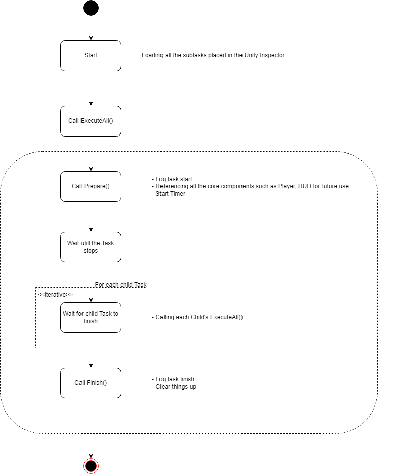

# BaseTask


---


`BaseTask` is the template for any other tasks in Unity. It inherits from `MonoBehaviour`, so it works like any other Unity script.

The `BaseTask` follows this working logic (as illustrated in the figure above):

1. **Initialization**: When the task is activated by Unity, the `Start()` method is called. This method loads all child tasks (if any) and assigns them to the `_subTasks` list.
2. **Execution Trigger**: An external script, such as an Experiment, calls the `BaseTask.ExecuteAll()` method to start the task.
3. **Preparation**: The task prepares itself by initializing necessary references and settings through the `Prepare()` method.
4. **Execution**: The task waits for a specified timer or other methods to stop the task. During this period, the task performs its designated functions.
5. **Child Task Execution**: If there are any child tasks, the task runs them sequentially.
6. **Cleanup**: Once the task completes its execution or is stopped, the `Finish()` method is called to clean up resources and reset any modified states.

## Structure of `BaseTask`

### Member Variables

| Variable               | Purpose                                                                             |
| ---------------------- | ----------------------------------------------------------------------------------- |
| `taskType`             | The type of the task: `Structural`, `Functional`, `Interactive`                     |
| `id`                   | (currently not supported) Resume identifier                                         |
| `Settings`             | Reference to `Settings` instance                                                    |
| `Experiments`          | Reference to `Experiment` instance                                                  |
| `Player`               | Reference to `Player` instance                                                      |
| `PlayerEvent`          | Reference to `PlayerEvent` instance                                                 |
| `HUD`                  | Reference to `HUD` instance                                                         |
| `_subTasks`            | A collection of all child tasks                                                     |
| `timer`                | The maximum time the task can run                                                   |
| `randomizedTimer`      | Boolean value to use a randomized timer                                             |
| `minTimer`             | Minimum value for the randomizer                                                    |
| `maxTimer`             | Maximum value for the randomizer                                                    |
| `elapsedTime`          | Time passed since the task started                                                  |
| `isRunning`            | Boolean value checked every frame; if set to `false`, the task will end             |
| Other `bool` Variables | Additional status flags for various functionalities                                 |

### Methods

#### `Start()`
The `Start()` method performs the following:
1. Reads all child `Transform` components of the `GameObject` to which the task script is attached.
2. Sorts these child objects as they appear in the Unity Inspector.
3. Obtains a `BaseTask` component from each child `GameObject` and adds them to a list.
4. Assigns this list to the member variable `_subTasks`.

#### `Prepare()`
The `Prepare()` method prepares the task for execution:
1. Gets references to all core components, including `Settings`, `Experiment`, `Player`, `PlayerEvent`, `HUD`, and `Logger`.
2. Sets the running mode of the task based on `taskType`:
   - For `Functional` and `Structural` types, it calls `Finish()` or, if it has children, calls each child's `ExecuteAll()` method before `Finish()`.
   - For `Interactive` types, it blocks the experiment after `Prepare()` until the timer ends or another trigger calls `StopCurrentTask()`.
3. If `randomizedTimer` is `true`, sets a random timer value between `minTimer` and `maxTimer`.
4. Calls the `StartTimer()` method to time the task.

#### `Finish()`
The `Finish()` method clears up after the task:
1. Sets `isCompleted` to `true` and logs a message.
2. For any other task, manually clear up the following:
   - Unregister any `PlayerEvent` actions registered in `Prepare()`.
   - Reset any changes made to `HUD`.
   - Restore any changes made to the camera mask.

#### `ExecuteAll()`
This method runs the `Prepare()` and `Finish()` methods for the task. It also loops over all child tasks and runs them sequentially. The `Finish()` method for each task runs only after all children's `Finish()` methods have been called.

#### `StopCurrentTask()`
This method sets the task's running status to `need to be stopped`.

#### `StartTimer()`
This method starts a timer based on the timer fields. When the timer reaches its limit, the task stops.

## Example: Creating a New Instruction Task

Here's how to create a new instruction task using `BaseTask`:

```csharp
using UnityEngine;
using LandmarksR.Scripts.Experiment.Tasks;

public class SimpleInstructionTask : BaseTask
{
    protected override void Prepare()
    {
        // Set the task type to Interactive
        SetTaskType(TaskType.Interactive);

        // Call the base class's Prepare() method
        base.Prepare();

        // Set the title and content for the HUD
        HUD.SetTitle("A simple title").SetContent("ABCDEFG");

        // Register the OnConfirm action, which will be called when the user hits the confirm button
        PlayerEvent.RegisterConfirmHandler(OnConfirm);
    }

    protected override void Finish()
    {
        // Call the base class's Finish() method
        base.Finish();

        // Unregister the OnConfirm action
        PlayerEvent.UnregisterConfirmHandler(OnConfirm);

        // Clear the title and text from the HUD
        HUD.ClearAllText();
    }

    private void OnConfirm()
    {
        // Stop the current task
        StopCurrentTask();
    }
}
```

### Explanation

- The notation `: BaseTask` tells the compiler that your `SimpleInstructionTask` inherits from the `BaseTask` template (class).
- The `Prepare()` method is overridden to customize the task:
  - `SetTaskType` sets the type to `Interactive` so the task runs until `StopCurrentTask` is manually called.
  - `base.Prepare()` initializes all core component fields.
  - `HUD.SetTitle().SetContent()` sets the title and content text for the HUD.
  - `PlayerEvent.RegisterConfirmHandler()` registers the `OnConfirm` action, defined below.
- The `Finish()` method cleans up after the task:
  - Calls `base.Finish()`, which logs the `Finish()` action by default.
  - `PlayerEvent.UnregisterConfirmHandler()` unregisters the `OnConfirm` action.
  - `HUD.ClearAllText` sets all text in the HUD to empty strings.

This structure ensures that your tasks are well-organized and maintainable.


