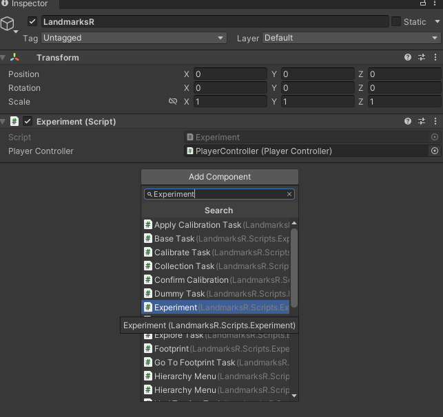
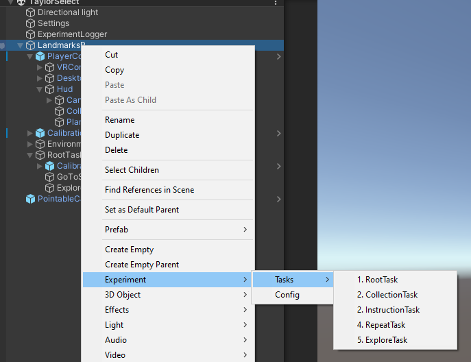
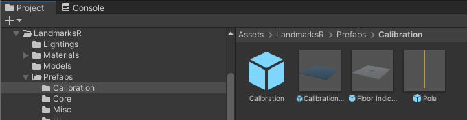

# Core Components

LandmarksR consists of several core components that control how the experiment runs and how participants interact with the experiment. Here is a list of all the core components:

| Name                  | Purpose                                                             |
| --------------------- | ------------------------------------------------------------------- |
| Experiment            | Entry point for all components                                      |
| PlayerController      | Manages interaction between the participant and the experiment      |
| PlayerEventController | Handles triggering events for both VR and desktop scenarios         |
| HUD                   | Controls the display of the 3D environment, text, and more          |
| ExperimentLogger      | Logs data to local storage or a remote server                       |
| Settings              | Configuration settings for everything                               |

All these components are initialized before any tasks. You will frequently reference them when coding your own tasks.

## `Experiment`
- Acts as a singleton ([What is a singleton?](https://stackoverflow.com/questions/2155688/what-is-a-singleton-in-c))
- Provides reference to the `PlayerController`
- Initiates the `RootTask`

## `PlayerController`
- Changes the display mode (Desktop or VR)
- Logs data, including player position and task start and end times
- Provides references to:
  - VR sub-controller
  - Desktop sub-controller 
  - HUD
  - `PlayerEventController`
  - `FirstPersonController` (desktop only)

## `PlayerEventController`
- Allows registering and unregistering keyboard keys for multiple actions
- Allows registering and unregistering VR joystick keys for multiple actions

## `HUD`
- Changes HUD display position:
  - HUD can follow the participant
  - HUD can be fixed at a specific position
- Changes displaying text:
  - Change title, content, opacity
- Controls a progress bar 
- Changes camera mask layer

## `ExperimentLogger`
- Logs data to local storage and/or a remote server
- Outputs formatted data to CSV 

## `Settings`
- Provides configuration settings for everything

# Setup Core Components for an Empty Scene

### Step 1: Create a `GameObject` Called "LandmarksR"
- Create a new GameObject and name it "LandmarksR".
- Click on `Add Component` and add the `Experiment` script.

### Step 2: Add `PlayerController`
- In the Project Explorer, navigate to `Assets/LandmarksR/Prefabs/Core`.
- Find the `PlayerController` prefab and drag it under the "LandmarksR" GameObject.
- Assign the `PlayerController` to the `Experiment` component on the "LandmarksR" object.

### Step 3: Create `Environment`
- Create an empty GameObject called "Environment".
- Assign the environment tag to it.

### Step 4: Create RootTask
- Create an empty root task by right-clicking on the "LandmarksR" GameObject.
- Navigate to `Experiment/Tasks/1.RootTask` and click on `RootTask` to create it.
- Remember to change the tag of this GameObject to `RootTask`.

### Step 5 (Optional): Create Settings and Experiment Logger 
- Create a new GameObject called "Settings" and add the `Settings` script to it. Refer to the settings page for more configuration information.
- Create a new GameObject called "ExperimentLogger" and add the `ExperimentLogger` script to it.
- Note: These components are optional if you use `Assets/LandmarksR/Start Screen` to run the task.

### Step Ex.1: Create Input Module (VR)
- In the same `Assets/LandmarksR/Prefabs/Core` folder, find the `PointableCanvasModule` and add it to the root of the scene hierarchy.

### Step Ex.2: Add Calibration Space and Calibration Task (VR)
- Drag and drop the `CalibrationTask` under `RootTask`, ensuring it is the **first** task.
- Drag and drop the `Calibration Space` into the "LandmarksR" GameObject (not under the "Environment").
