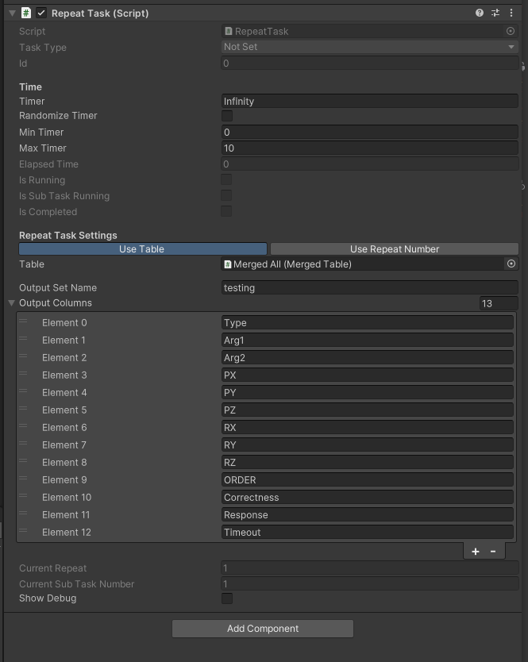

# Data
## DataFrame

If you have experience with the `pandas` Python package, you should be familiar with `pandas.DataFrame`. The `DataFrame` in LandmarksR serves a similar purpose but with fewer functionalities, as it is not intended for data analysis.

If you do not have any `pandas` experience, think of the `DataFrame` here as a 2D matrix that can hold more than just numerical data.

Here's a simple data snippet:

```csharp
var builder = new DataFrameBuilder();

var df = builder.AddColumn(1, 2)
	.AddColumn("John", "Alice")
	.AddRow(3, "Bob")
	.Build();

// df will be built as
/*
1,John
2,Alice
3,Bob
*/

Debug.Log(df.GetValue<string>(0,1)) // Output: John
Debug.Log(df.GetValue<int>(2,0)) // Output: 3
```

## `Table`

`Table`s are Tasks that wrap around the `DataFrame`, allowing you to load, change, and save `DataFrame` objects directly. There are two types of tables available in the Unity editor:
1. `TextTable`
2. `MergedTable`

### `TextTable`


`TextTable`s can be used to load trial information without the need for coding. In the illustration above, a `csv` file has been loaded into the serialized field of the editor. When you hit the play button or build and run the project, all the strings here will be assigned to the actual fields of the `TextTable`.

### `MergedTable`


`MergedTable`s are used to combine separate `Table` objects. They can merge all `Table` objects, allowing you to consolidate your custom `Table` objects.

You can choose the merge direction: 
- Horizontally: Columns will be joined together.
- Vertically: Rows will be joined together.

By default, the merge only combines the indexes of the original table to save memory usage (soft merge). You can also perform a hard merge that copies the entire data.

> [!IMPORTANT] 
> The current version (v0.0.1) only allows a soft merge one single time. If you first merge 2 `TextTable`s into one table (Table A) and then merge 4 others into another table (Table B), and you want to merge Table A and Table B into Table C, you need to hard merge Table A and Table B. This limitation will be addressed in the next version.

## How to Reference Values in Tables


To reference values from the Table, the simplest way is to use the `RepeatTask` component. This component allows you to select the Table you want to use in the Unity Inspector. When the `RepeatTask` starts, it reads each row of the Table as `CurrentData`. You can then obtain the desired column using built-in methods such as `GetFirstInColumn<string>`.

These methods are covered in detail on the `DataFrame` page and in the API documentation. Here is a simple snippet as an example. This snippet sets the Current Target:

```csharp
// This is a part of an instruction task
// This task intends to tell the participant what the target is
// Other parts are omitted here
// ...

protected void Prepare()
{
	SetTaskType(TaskType.Interactive);
	base.Prepare();

	// Get the RepeatTask
	if (transform.parent.TryGetComponent<RepeatTask>(out var repeatTask))
	{
		var currentData = repeatTask.CurrentData;
		var targetName = currentData.GetFirstInColumn<string>("TargetName");
		HUD.SetContent("Your Target is: " + targetName);
	}
}

// ...
```

## Output Data

To output data, the simplest way is to use methods in `Logger` within the `RepeatTask`. The `Logger` has four methods:

1. `Logger.BeginDataset(outputSetName, outputColumns)`: Creates a CSV file with columns to output.
2. `Logger.SetData(outputSetName, column, value)`: Sets the column value for the current output row.
3. `Logger.LogDataRow(outputSetName)`: Flushes the rows to the CSV file.
4. `Logger.EndDataset(outputSetName)`: Safely closes the file.

In `RepeatTask`, you can set the `outputSetName` and `outputColumns` in the Unity Inspector.

