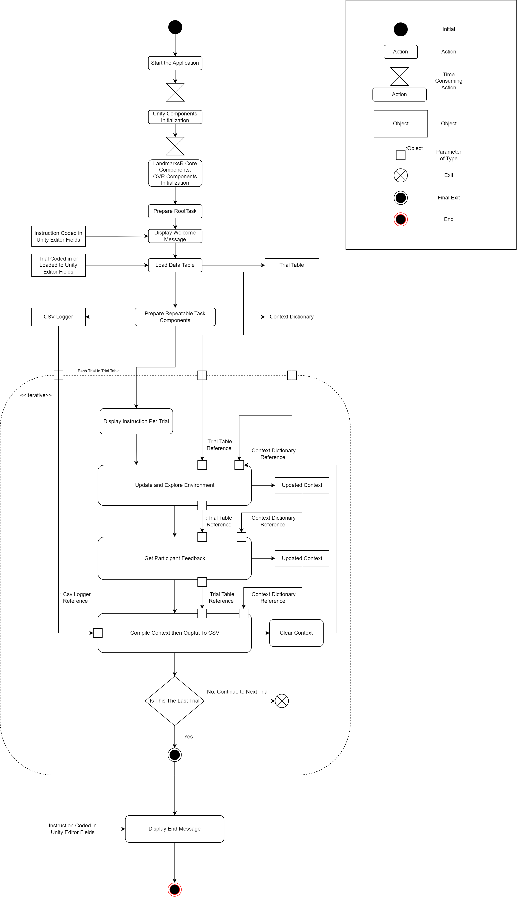

# Introduction to LandmarksR
LandmarksR is a Unity framework supported by Meta Quest. The following table highlights the similarities and differences between Landmarks and LandmarksR:

| Items                     | Landmarks | Landmarks R               |
| ------------------------- | --------- | ------------------------- |
| Steam VR support          | ✅         | ❌                         |
| Meta Quest support        | ❌         | ✅                         |
| Modular components        | ✅         | ✅                         |
| CSV Logging               | ✅         | ✅                         |
| Remote Logging            | Azure?    | RESTful API               |
| Easier Trial Data Loading | ❌         | ✅                         |
| Assets Size               | Over 1GB  | Currently less than 100MB |
| Documentation             | Some      | Planned to be extensive   |

To start a new LandmarksR project, follow these steps:

1. Clone the repository:
   ```bash
   git clone https://github.com/ChrastilLab/LandmarksR
   ```
2. Add the project to your Unity Hub and open it.

If everything goes smoothly, you should now have an empty LandmarksR project. Before diving into development, it's essential to understand the framework's basics.

### Overview of a Sample LandmarksR Project

Below is an activity diagram illustrating the typical flow of a LandmarksR application:



  
This diagram may seem intimidating, but to build a project, we only need to do two things:

1. Set up the built-in core components.
2. Use the built-in tasks or write your own tasks.

The next few pages will cover both of these steps.