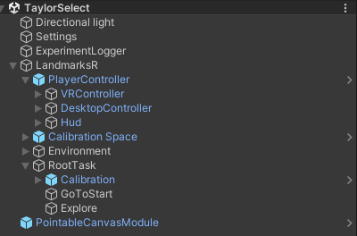

# LandmarksR Unity Structure
Let's first break down the framework structure inside the Unity Editor

# Overall Structure
Here's a screenshot of that

| GameObject                                            | Required By LandmarksR | Purpose                                                                    | Assigned/Required Tag |
| ----------------------------------------------------- | ---------------------- | -------------------------------------------------------------------------- | --------------------- |
| Directional Light                                     | No                     | Lighting                                                                   | NA                    |
| Settings                                              | Yes (optional)         | Configuration for the current scene, but optional if you use Startup Scene | NA                    |
| ExperimentLogger                                      | Yes (optional)         | Logging system for the current, option if you use Startup Scene            | NA                    |
| LandmarksR                                            | Yes                    | Has Experiment.cs attached, entry point for the framework                  | NA                    |
| LandmarksR.PlayerController                           | Yes                    | Controller for player interaction and canvas display                       | NA                    |
| LandmarksR .PlayerController .VRController      | Yes                    | Sub Controller for VR interaction                                          | Player                |
| LandmarksR .PlayerController .DesktopController | Yes                    | Sub Controller for desktop interaction                                     | Player                |
| LandmarksR .PlayerController .Hud               | Yes                    | Controlling                                                                |                       |
| LandmarksR.CalibrationSpace                           | Yes (VR only)          | (VR only) Calibration environment of the headset                           | Calibration           |
| LandmarksR.Environment                                | Yes                    | Environment to place all your GameObjects                                  | Environment           |
| RootTask                                              | Yes                    | Entry point for all the `Task`                                             | RootTask              |
| PointableCanvasModule                                 | Yes                    | Input Module with VR support                                               | NA                    |

# Where to add your own `GameObject`/Scripts

There will be a time when you want to more `GameObject`s and Scripts. To do this, first decide what kind of `GameObject` you want to add

- if the `GameObject` is an UI Object that needs to be displayed on HUD, add it under the `HUD` and change the `Hud.cs`

> [! NOTE]
> Future version may implement option  to add your own component without modifying the `Hud.cs` 

- if the `GameObject` is a UI Object that is placed somewhere in the environment, add it under the `Environment`
- if the `GameObject` is a non-UI Object but not a model you want to render, put it outside of the `LandmarksR`
- if the `GameObject` is a 3D model you want to render, put it inside the Environment and tag it properly

