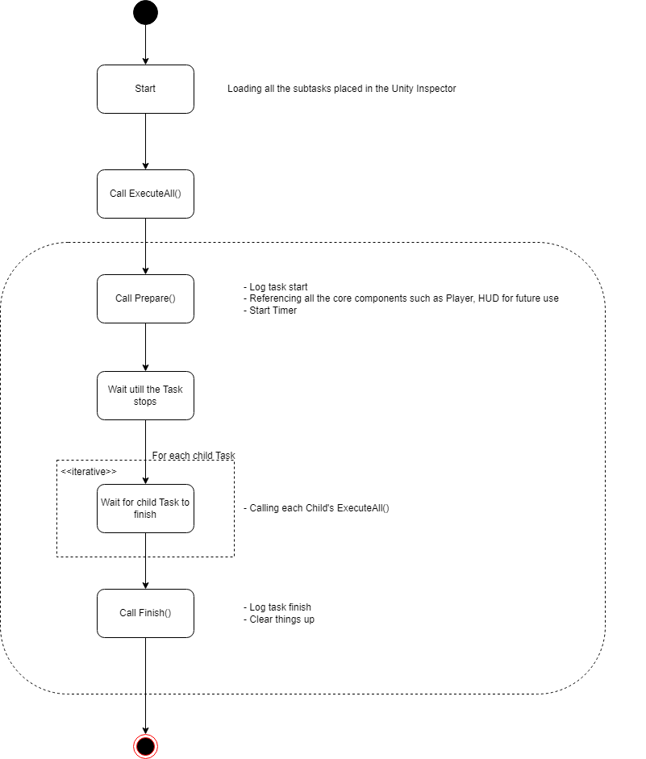

# Task in LandmarksR

Tasks in LandmarksR are the building blocks of your experiment. If you have experience with the older version of Landmarks, you should be familiar with them. Simply drag and drop them in the inspector, and you'll have a fully functioning experiment.

Currently, we support the following tasks, categorized into three groups (excluding `BaseTask`):
- **Structural**
- **Functional**
- **Interactive**

Some Functional or Interactive Tasks must be a child of Structural Tasks, meaning you need to place them under the corresponding parent task in the Unity Inspector.

### Structural Tasks

Structural tasks are used to organize your other tasks, allowing them to hold multiple sub-tasks.

| Task Name       | Purpose                                                                                              |
| --------------- | ---------------------------------------------------------------------------------------------------- |
| RootTask        | The root folder for placing all your tasks                                                           |
| CollectionTask  | A subfolder for grouping multiple tasks                                                              |
| RepeatTask      | A task that repeats multiple times, useful for making trials by iterating over rows in a table       |
| CalibrationTask | A task used for space calibration in VR mode                                                         |

### Functional Tasks

Functional tasks perform a single or a set of actions. They are executed once unless duplicated in the Unity Inspector.

| Task Name       | Purpose                                  |
| --------------- | ---------------------------------------- |
| InstructionTask | A task that displays text instructions   |

### Interactive Tasks

Interactive tasks handle interactions between the application and the participant within a given context. For example, in a typical Wayfinding experiment, where the participant must find a target, an interactive task should be used.

| Task Name         | Purpose                                                                         | Must be a Child of |
| ----------------- | ------------------------------------------------------------------------------- | ------------------ |
| ExploreTask       | Allows exploration of an environment within a given time limit                  | NA                 |
| NavigationTask    | Requires the participant to locate a target by walking to it                    | RepeatTask         |
| GoToFootprintTask | Requires the participant to step on a footprint texture                        | NA                 |

> Note: Calibration related task are omitted here as they should only be modified when absolutely necessary.

###   `BaseTask`

We have placed the introduction of `BaseTask` at the end because it is the most crucial task of all. To create other tasks effectively, you must thoroughly understand every aspect of `BaseTask`. This introduction will provide a structural overview through a diagram. For detailed information, refer to the [BaseTask](Tasks/BaseTask.md) Page.

